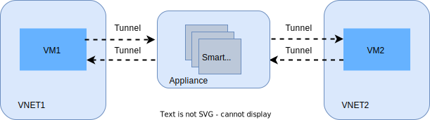
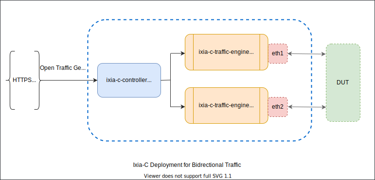

[TOC]

# **VNET to VNET**

## **Overview**

This test plan corresponds to the phase where standardized, automated test cases will be scripted to verify Data plane Testing Stage 3 as outlined in [dash test maturity stages](https://github.com/PLVision/DASH/blob/test-framework-extension/test/docs/dash-test-maturity-stages.md#data-plane-testing-stage-2-standardized-automated-test-cases). In these tests we want to levarage the snappi API to test some of the functional aspects of DUT. By verifying and validating the scaling aspects of the switches (hardware/BMv2) we are able to emperically baseline the scaling values. Additonally, we also want to check some of the relevant counters to features like IPv4, IPv6, TCP, UDP, common traffic stats etc.

### **Scope**

These test cases are targeted for testing the feature functionality of DASH implementation. The purpose of these test cases are to verify inbound/outbound/bidirectional traffic streams originating and terminating at the traffic generator. We plan to use the OTG (Open traffic generator model) by leveraging the snappi APIs. 

### **[Testbed](../testbed/)**

The generic testbed setup may consist of two OTG (Open traffic generator model-based traffic tool) connected to two ports of a switch (hardware-based or BMv2 software switch). In this specifc testbed setup we will use [Ixia-c](https://github.com/open-traffic-generator/ixia-c) which is a modern, powerful, and API-driven open traffic generator model-based traffic tool that will generate traffic to observe the behavior of the device under test (DUT).

### **Testbed Topology** 

The tesbed is setup to emulate a VNET to VNET scenario and to test the mechanisms of VM to VM communication in VNET as shown below.

To emulate each VM in a VNET an Ixia-c port will be utilized. The BMv2 will be the DUT (This can later be replaced by a hardware-based appliance that connects to physical ports of a traffic generator)

### **Test Methodology**

Following test methodologies will be utilized to verify and validate the behavior of the switch

- Traffic generator will be used to configure traffic streams that originate and/or terminate on Ixia-C ports
- Data traffic will be sent from VNET to VNET. In particular, it allows the following features: VM to VM communication in VNET, route support, LPM support, ACL support. This is to verify the following performance properties: CPS, flow, PPS, and rule scale.
- Depending on the test cases, a combination of UDP traffic for IPv4, IPv6 addresses will be generated

### **Test Cases**
[TODO: Update Table]

| Test Description                                             | Expected Result               |
| :----------------------------------------------------------- | :------------------------ |
| UDP IPv4 inbound  | Traffic originating from one VNet simulated terminates on another simulated VNet. Counters in DUT in the inbound direction are accurately incremented.   Verify latency measurements   Verify packet loss is 0 (Tx frames - Rx frames = 0)   Verify configured throughput rate is achieved in traffic statistics  |
| UDP IPv4 outbound | Traffic originating from one VNet simulated terminates on another simulated VNet. Counters in DUT in the outbound direction are accurately incremented.   Verify latency measurements   Verify packet loss is 0 (Tx frames - Rx frames = 0)   Verify configured throughput rate is achieved in traffic statistics  |
| UDP IPv4 bidirectional  | Traffic originating from one VNet simulated terminates on another simulated VNet. Verify bidrectional traffic Counters in DUT in the outbound direction are accurately incremented.   Verify latency measurements   Verify packet loss is 0 (Tx frames - Rx frames = 0)   Verify configured throughput rate is achieved in traffic statistics  |
| UDP IPv6 inbound | Traffic originating from one VNet simulated terminates on another simulated VNet. Counters in DUT in the inbound direction are accurately incremented.   Verify latency measurements   Verify packet loss is 0 (Tx frames - Rx frames = 0)   Verify configured throughput rate is achieved in traffic statistics  |
| UDP IPv6 outbound direction | Traffic originating from one VNet simulated terminates on another simulated VNet. Counters in DUT in the outbound direction are accurately incremented.   Verify latency measurements   Verify packet loss is 0 (Tx frames - Rx frames = 0)   Verify configured throughput rate is achieved in traffic statistics  |
| UDP IPv6 bidirectional  | Traffic originating from one VNet simulated terminates on another simulated VNet. Verify bidrectional traffic Counters in DUT in the outbound direction are accurately incremented.   Verify latency measurements   Verify packet loss is 0 (Tx frames - Rx frames = 0)   Verify configured throughput rate is achieved in traffic statistics  |                                                 
|  ACL inbound | Verify data traffic is allowed and unwanted traffic based on ACL is dropped. Verify ACL inbound counters on DUT are incremented
| ACL outbound  | Verify data traffic is allowed and unwanted traffic based on ACL is dropped. Verify ACL outbound counters on DUT are incremented
| BGP underlay | Verify BGP neighborship is established. Verify BGP counters on DUT are incremented

